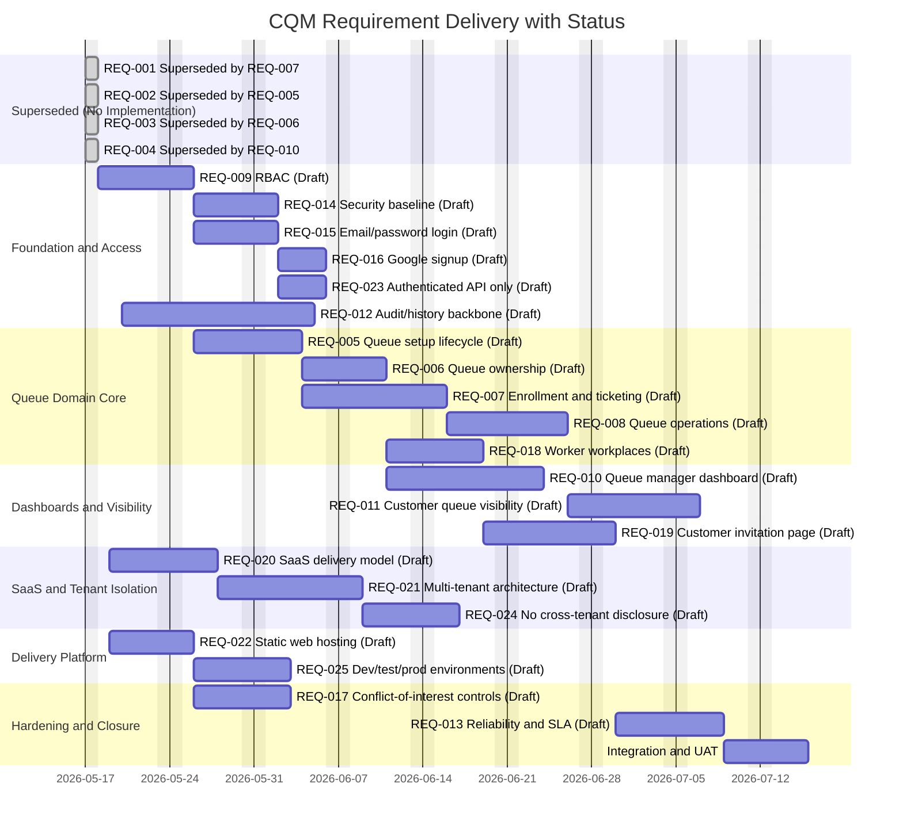

# CQM-IMP-001: Requirement Delivery Plan and Gantt

## Metadata

- ID: `CQM-IMP-001`
- Status: `Draft`
- Priority: `High`
- Owner: `Engineering Lead`
- Project Key: `CQM`
- Created: `2026-05-17`
- Updated: `2026-05-17`

## Requirement Status Snapshot

Status date: `2026-05-17`

| Requirement ID | Title | Status |
|---|---|---|
| CQM-REQ-001 | Customer can get queue number in specific queue | Superseded by CQM-REQ-007 |
| CQM-REQ-002 | System can create many queues | Superseded by CQM-REQ-005 |
| CQM-REQ-003 | Every queue must have a manager user | Superseded by CQM-REQ-006 |
| CQM-REQ-004 | Queue manager dashboard for owned queues | Superseded by CQM-REQ-010 |
| CQM-REQ-005 | Queue setup and lifecycle | Draft |
| CQM-REQ-006 | Queue ownership and accountability | Draft |
| CQM-REQ-007 | Customer enrollment and ticketing | Draft |
| CQM-REQ-008 | Queue processing operations | Draft |
| CQM-REQ-009 | Role-based access control | Draft |
| CQM-REQ-010 | Queue manager dashboard | Draft |
| CQM-REQ-011 | Customer queue visibility | Draft |
| CQM-REQ-012 | Audit and history | Draft |
| CQM-REQ-013 | Reliability and performance SLA | Draft |
| CQM-REQ-014 | Security and data protection | Draft |
| CQM-REQ-015 | User login with email and password | Draft |
| CQM-REQ-016 | User signup with Google | Draft |
| CQM-REQ-017 | Role conflict-of-interest control | Draft |
| CQM-REQ-018 | Worker workplaces with unique numbers | Draft |
| CQM-REQ-019 | Customer web queue state and workplace invitation | Draft |
| CQM-REQ-020 | SaaS delivery model | Draft |
| CQM-REQ-021 | Multi-tenant architecture | Draft |
| CQM-REQ-022 | Static hosting for web application | Draft |
| CQM-REQ-023 | API secured for authenticated users only | Draft |
| CQM-REQ-024 | No cross-tenant data disclosure | Draft |
| CQM-REQ-025 | Dev, test, and production environments | Draft |

## Gantt Diagram

## Notes

- `CQM-REQ-001..004` are retained for history and traceability only.
- Active implementation scope is `CQM-REQ-005..025`.
